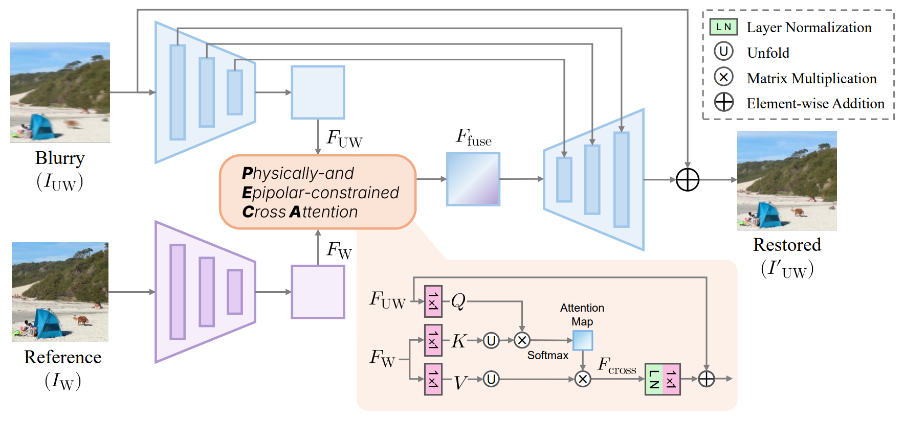

# PECA: Physically-and Epipolar-constrained Cross Attention

[](https://eccv.ecva.net/)
[](https://opensource.org/licenses/MIT)
[](https://creativecommons.org/licenses/by/4.0/)

The official pytorch implementation of the paper **[A Benchmark for Heterogeneous Stereo Deblurring with Physically- and Epipolar-constrained Cross Attention (ECCV2026)](https://openreview.net/forum?id=Wa0C2CXiEd&referrer=%5Bthe%20profile%20of%20Hoju%20Shin%5D(%2Fprofile%3Fid%3D~Hoju_Shin1))**



#### 저자
>Modern stereo-capable smartphones enable immersive XR content capture. However, hardware heterogeneity across camera modules often causes severe asymmetric blur artifacts. Existing methods and benchmarks largely assume homogeneous stereo setups and therefore do not explicitly address such asymmetric degradation. To bridge this gap, we present a dedicated framework for heterogeneous stereo deblurring. First, we introduce the heterogeneous stereo deblurring (HSD) dataset, constructed from real smartphone stereo captures via multi-frame integration. Second, we propose physically- and epipolar-constrained cross attention (PECA), a lightweight module that restricts cross-view matching to an epipolar search window bounded by a optics-derived disparity upper bound. By enforcing physically valid disparity constraints, PECA enables efficient and reliable cross-view feature fusion. Moreover, our confidence-weighted attention with residual fusion emphasizes cross-guided deblurring when correspondences are reliable, while naturally falling back to self-deblurring in occluded or unreliable regions. PECA is architecture-agnostic and consistently improves CNN-, Transformer-, and NAFNet-based baselines. Extensive experiments on HSD show that PECA-enhanced models achieve improved restoration performance with favorable efficiency. The dataset and source code will be made publicly available.

## Download Dataset
[HuggingFace](https://huggingface.co/datasets/hj-shin/HSD)

## Installation

```python
python 3.10.19
pytorch 2.7.0
cuda 12.8
```

```
git clone https://github.com/pknu-v-lab/PECA.git
cd PECA
pip install -r requirements.txt
python setup.py develop
```
