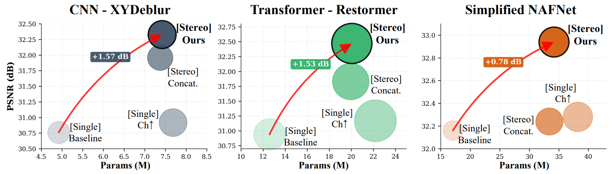

# A Benchmark for Heterogeneous Stereo Deblurring with Physically- and Epipolar-constrained Cross Attention

[](https://eccv.ecva.net/)
[](https://opensource.org/licenses/MIT)
[](https://creativecommons.org/licenses/by/4.0/)

The official pytorch implementation of the paper **[A Benchmark for Heterogeneous Stereo Deblurring with Physically- and Epipolar-constrained Cross Attention (ECCV2026)]())**

<p align="center">
  
</p>

#### Hoju Shin*, Jiah Kim*, Seung-Wook Kim, Seowon Ji
>**Abstract**: Modern stereo-capable smartphones enable immersive XR content capture. However, hardware heterogeneity across camera modules often causes severe asymmetric blur artifacts. Existing methods and benchmarks largely assume homogeneous stereo setups and therefore do not explicitly address such asymmetric degradation. To bridge this gap, we present a dedicated framework for heterogeneous stereo deblurring. First, we introduce the heterogeneous stereo deblurring (HSD) dataset, constructed from real smartphone stereo captures via multi-frame integration. Second, we propose physically- and epipolar-constrained cross attention (PECA), a lightweight module that restricts cross-view matching to an epipolar search window bounded by a optics-derived disparity upper bound. By enforcing physically valid disparity constraints, PECA enables efficient and reliable cross-view feature fusion. Moreover, our confidence-weighted attention with residual fusion emphasizes cross-guided deblurring when correspondences are reliable, while naturally falling back to self-deblurring in occluded or unreliable regions. PECA is architecture-agnostic and consistently improves CNN-, Transformer-, and NAFNet-based baselines. Extensive experiments on HSD show that PECA-enhanced models achieve improved restoration performance with favorable efficiency. (*Equal Contribution.)

## Download Dataset
HSD dataset is available on [Hugging Face](https://huggingface.co/datasets/hj-shin/Heterogeneous-Stereo-Deblurring), [Google Drive](https://drive.google.com/drive/folders/1aBukX8v2LeFJiR8Ej09ZGKMJ7F6sB39i)

#### Dataset structure
```text
HSD/
├── train/
│   ├── input/
│   │   ├── 20260204_090602000_iOS_00008.png
│   │   ├── 20260204_090602000_iOS_00031.png
│   │   └── ...
│   ├── target/
│   │   ├── 20260204_090602000_iOS_00008.png
│   │   ├── 20260204_090602000_iOS_00031.png
│   │   └── ...
│   └── guide/
│       ├── 20260204_090602000_iOS_00008.png
│       ├── 20260204_090602000_iOS_00031.png
│       └── ...
│
└── test/
    ├── input/
    │   ├── 20260204_090602000_iOS_00008.png
    │   ├── 20260204_090602000_iOS_00031.png
    │   └── ...
    ├── target/
    │   ├── 20260204_090602000_iOS_00008.png
    │   ├── 20260204_090602000_iOS_00031.png
    │   └── ...
    └── guide/
        ├── 20260204_090602000_iOS_00008.png
        ├── 20260204_090602000_iOS_00031.png
        └── ...
````


## Installation
This implementation based on [BasicSR](https://github.com/xinntao/BasicSR) which is a open source toolbox for image/video restoration tasks and [NAFNet](https://github.com/megvii-research/NAFNet), [Restormer](https://github.com/swz30/Restormer).

```python
python 3.10.19
pytorch 2.7.0
cuda 12.8
```

```
git clone https://github.com/shinhoju/PECA.git
cd PECA
pip install -r requirements.txt
python setup.py develop
```


## Quick Start

1. Generate image patches from full-resolution training images of HSD dataset
```
cd scripts
python generate_patches.py 
```

2. To train models, run
```
./train.sh ./options/PECA_XYDeblur.yml
./train.sh ./options/PECA_Restormer.yml
./train.sh ./options/PECA_NAFNet_w64.yml
```
**Note:** The above training script uses 2 GPUs by default. To use any other number of GPUs, modify [train.sh](train.sh) and [option files](options/).


## Results and Pre-trained Models



| Backbone | Variant | Input | PSNR | SSIM | Pretrained model | Config |
|---|---|---|---:|---:|---|---|
| XYDeblur | baseline | Single | 30.76 | 0.9444 |  |  |
| XYDeblur | **PECA** | Stereo | 32.22 | 0.9620 | [gdrive](https://drive.google.com/file/d/10aX213Sp6P2UfdDN-MAyuL8YwJ3QDV5E/view?usp=drive_link) | [link](options/PECA_XYDeblur.yml) |
| Restormer | baseline | Single | 30.94 | 0.9444 |  |  |
| Restormer | **PECA** | Stereo | 32.47 | 0.9636 | [gdrive](https://drive.google.com/file/d/1hzr_iClVBZUatZXRT-YCWJBqM2MZT1Y8/view?usp=drive_link) | [link](options/PECA_Restormer.yml) |
| NAFNet | baseline | Single | 32.16 | 0.9579 |  |  |
| NAFNet | **PECA** | Stereo | 32.92 | 0.9669 | [gdrive](https://drive.google.com/file/d/1CDL0MpdMgDTCjyo1YtxOHihvL8ZCMTws/view?usp=drive_link) | [link](options/PECA_NAFNet_w64.yml) |


## Citation
If you find this work useful for your research, please cite our paper:

```
@inproceedings{shin2026PECA,
    title={A Benchmark for Heterogeneous Stereo Deblurring with Physically- and Epipolar-constrained Cross Attention}, 
    author={Shin, Hoju and Kim, Jiah and Kim, Seung-Wook and Ji, Seowon},
    booktitle={ECCV},
    year={2026}
}
```
